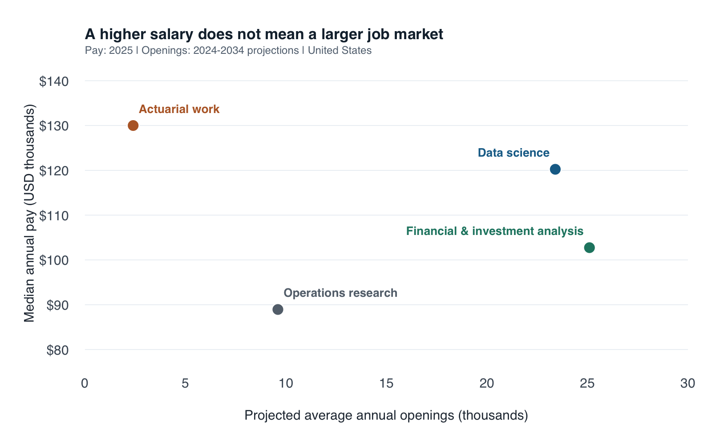

```{r}
#| label: setup
#| include: false
source("scrape-careers.R")
source("plot-careers.R")
careers <- build_careers("data", refresh = FALSE)
money <- function(x) paste0("$", format(x, big.mark = ",", scientific = FALSE, trim = TRUE))
count <- function(x) format(x, big.mark = ",", scientific = FALSE, trim = TRUE)
ds <- careers[careers$soc == "15-2051.00", ]
ora <- careers[careers$soc == "15-2031.00", ]
fin <- careers[careers$soc == "13-2051.00", ]
act <- careers[careers$soc == "15-2011.00", ]
```

As a graduate student in Applied Economics and Data Science with a Financial
Mathematics background, I face a practical question: **which careers deserve
my limited job-search and preparation time?** The highest salary is tempting,
but it says little about the size of a job market or the preparation a role
requires. I compare four relevant paths: data science, operations research,
financial and investment analysis, and actuarial work.

## Collecting comparable evidence

I scraped four public [O\*NET® OnLine](https://www.onetonline.org/) occupation
profiles using R's `rvest` package. These pages report BLS wage and employment
data in a consistent format. This is a purposeful
comparison of four careers, not a representative sample of all graduate jobs.

The script below identifies HTML field labels, extracts their adjacent values,
removes dollar signs and commas, and saves numeric columns. It checks occupation
names and reference periods before producing a CSV. Financial and investment
analysts is a specific occupational category; I do not combine its salary with
the broader financial-analyst category's openings.

<details>
<summary>Show the complete rvest collection and cleaning script</summary>

```{r}
#| echo: false
#| results: asis
cat("\n```r\n", paste(readLines("scrape-careers.R"), collapse = "\n"), "\n```\n", sep = "")
```

</details>

I checked the site's [robots rules](https://www.onetonline.org/robots.txt) and
[content license](https://www.onetonline.org/help/license), used an identifiable
user agent, and spaced requests four seconds apart. The script stops on HTTP
errors and saves dated HTML snapshots. Re-rendering uses these snapshots, so
it adds no traffic. No login, CAPTCHA, or access restriction was bypassed.

The snapshot was collected on September 19, 2026, in New York (September 20 UTC).
It contains **2025 wages and 2024–2034 employment projections**, as published by
O*NET at collection time. These are different reference periods and should not
be described as a single year's observations. Growth is published in categories,
so I preserve those labels rather than inventing precise percentages.

```{r}
#| label: career-table
#| echo: false
comparison <- data.frame(
  Occupation = careers$occupation,
  `Median annual pay (2025)` = money(careers$median_annual_pay_usd),
  `Annual openings (2024–34 projection)` = count(careers$annual_projected_openings),
  `Growth category (2024–34)` = careers$growth_category,
  check.names = FALSE
)
knitr::kable(comparison)
```

## Pay and opportunity tell different stories

```{r}
#| label: fig-career-comparison
#| echo: false
#| out-width: 100%
#| fig-cap: "National occupational median pay (2025) versus projected average annual openings (2024–2034). Source: BLS data displayed by O*NET OnLine; saved September 19, 2026 (New York)."
#| fig-alt: "Scatterplot of four careers. Actuaries have the highest median salary but the fewest annual openings. Data scientists and financial and investment analysts have many more projected openings."
dir.create("figures", showWarnings = FALSE)
png("figures/career-comparison.png", width = 1600, height = 1000, res = 180)
plot_careers(careers)
invisible(dev.off())

```

Actuaries have the highest median pay, `r money(act$median_annual_pay_usd)`,
but only `r count(act$annual_projected_openings)` projected annual openings.
Data scientists combine `r money(ds$median_annual_pay_usd)` median pay with
`r count(ds$annual_projected_openings)` openings—about
`r round(ds$annual_projected_openings / act$annual_projected_openings, 1)` times
the actuarial total. For someone still exploring career directions, that
difference makes data science worth investigating alongside the salary leader.

Financial and investment analysts have the most openings in this comparison,
`r count(fin$annual_projected_openings)`, despite a lower median wage of
`r money(fin$median_annual_pay_usd)`. Operations research offers
`r count(ora$annual_projected_openings)` openings and
`r money(ora$median_annual_pay_usd)` median pay. Its emphasis on quantitative
decision-making makes it relevant to my training even though its wage is lower.

Preparation also matters. In the available O*NET education responses,
`r ds$education_response_pct`% of data-science respondents identify a bachelor's
degree as required, while `r ora$education_response_pct`% of operations-research
respondents identify a master's degree. These are survey responses, not universal
hiring rules. The financial-and-investment profile lacks this education breakdown;
the script records it as missing rather than guessing.

## Turning the comparison into a decision

My recommendation is to **prioritize exploring data-science and financial-and-investment
analyst roles**, while keeping operations research on the shortlist. A concrete
next step is to review ten current entry-level vacancies in each of the first
two categories, record recurring qualifications, and build one relevant project
for each. That follow-up would test whether broad occupational opportunities
translate into realistic roles for my experience and location.

Actuarial work remains attractive if I want its specialized preparation:
[BLS describes a series of professional exams](https://www.bls.gov/ooh/math/actuaries.htm).
I would investigate that commitment before choosing it solely for higher pay.

The comparison has limits. Occupational medians are not starting salaries.
[Projected annual openings](https://www.onetonline.org/link/localtrends/15-2051.00)
include growth and replacement needs; they are not live vacancies or exclusively
entry-level jobs. A larger count does not imply easier hiring without information
about applicant supply. National data also omit personal fit, local living costs,
and work-authorization requirements. The takeaway is to use pay and market size
to build an informed shortlist, then validate it against actual job requirements.

## Sources and reproducibility

The four profile links, raw snapshots, retrieval times, checksums, and package
versions are included in the [reproduction bundle](career-reproduction.zip).
Download the [cleaned data](data/careers.csv), [scraping script](scrape-careers.R),
[plotting script](plot-careers.R), or [data notes](DATA-NOTES.md).

Sources: [Data Scientists](https://www.onetonline.org/link/summary/15-2051.00),
[Operations Research Analysts](https://www.onetonline.org/link/summary/15-2031.00),
[Financial and Investment Analysts](https://www.onetonline.org/link/summary/13-2051.00),
and [Actuaries](https://www.onetonline.org/link/summary/15-2011.00).
The [source register](https://www.onetonline.org/help/online/datasources) identifies
BLS as the provider of wage and projection figures.

This analysis adapts information from O\*NET OnLine, U.S. Department of Labor,
Employment and Training Administration, under [CC BY 4.0](https://creativecommons.org/licenses/by/4.0/).
Qianzhao Li cleaned and visualized the data and added interpretation; USDOL/ETA
has not approved or endorsed these changes. O\*NET® is a trademark of USDOL/ETA.
External BLS data are attributed separately above.

To reproduce, unzip the bundle, open R in that folder, install `rvest` and `httr`
once, and run the following. The saved snapshots are used by default.

```{r}
#| eval: false
install.packages(c("rvest", "httr"))  # First run only
source("scrape-careers.R")
careers <- build_careers("data", refresh = FALSE)
source("plot-careers.R")
plot_careers(careers)
```

The website's [GitHub repository](https://github.com/qianzhaoli949-afk/qianzhao-website)
contains the website source; this post's code and data are in `blog/posts/post2/`.
