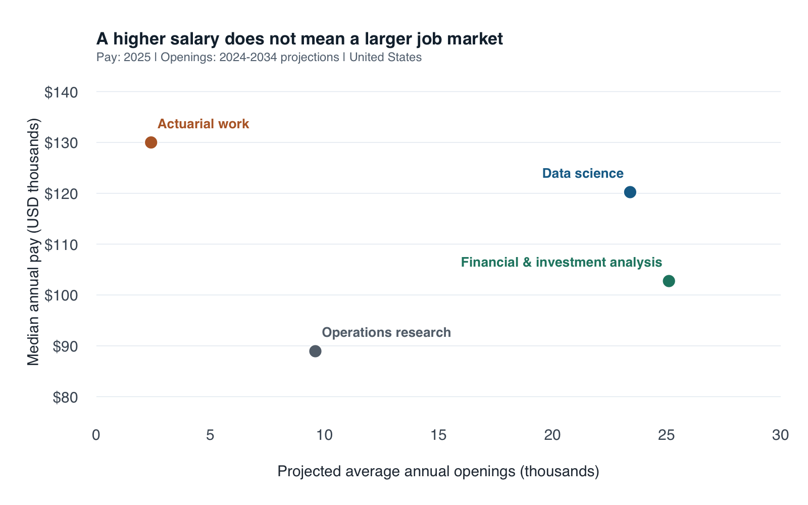
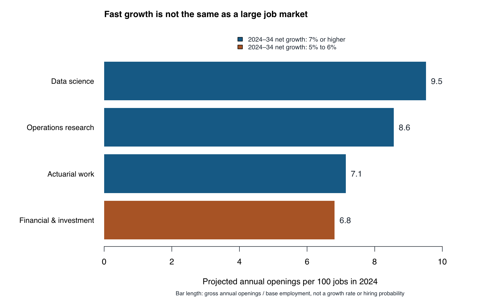

```{r}
#| label: setup
#| include: false
source("scrape-careers.R")
source("plot-careers.R")
source("analyze-careers.R")
careers <- build_careers("data", refresh = FALSE)
analysis <- analyze_careers(careers)
write.csv(analysis, "data/career-analysis.csv", row.names = FALSE)
money <- function(x) paste0("$", format(x, big.mark = ",", scientific = FALSE, trim = TRUE))
count <- function(x) format(x, big.mark = ",", scientific = FALSE, trim = TRUE)
ds <- careers[careers$soc == "15-2051.00", ]
ora <- careers[careers$soc == "15-2031.00", ]
fin <- careers[careers$soc == "13-2051.00", ]
act <- careers[careers$soc == "15-2011.00", ]
```

As a graduate student in Applied Economics and Data Science with a Financial
Mathematics background, I face a practical question: which careers deserve
my limited job-search and preparation time? The highest salary is tempting,
but it says little about the size of a job market or the preparation a role
requires. I compare four relevant paths: data science, operations research,
financial and investment analysis, and actuarial work.

## Collecting and cleaning the data

I scraped four public [O\*NET® OnLine](https://www.onetonline.org/) occupation
profiles using R's `rvest` package. These pages report BLS wage and employment
data in a consistent format. I chose these careers because they relate to my
studies, so the comparison does not cover every option for graduates.

My script finds the relevant labels on each page and extracts the values beside
them. It removes dollar signs and commas so R can read the numbers, then checks
the occupation names and years. I use the same occupation category for wages
and openings rather than mixing different types of financial analysts.

<details>
<summary>Show the complete rvest collection and cleaning script</summary>

```{r}
#| echo: false
#| results: asis
cat("\n```r\n", paste(readLines("scrape-careers.R"), collapse = "\n"), "\n```\n", sep = "")
```

</details>

I checked the site's [robots rules](https://www.onetonline.org/robots.txt) and
[content license](https://www.onetonline.org/help/license), used an identifiable
user agent, and spaced requests four seconds apart. The script stops on HTTP
errors and saves dated HTML snapshots. Re-rendering uses these snapshots, so
it adds no traffic. I did not bypass logins, CAPTCHAs, or access restrictions.

I collected the pages on September 19, 2026, in New York (September 20 UTC).
O*NET reported 2025 wages and 2024–2034 employment projections. These figures
refer to different periods. O*NET also reports growth in categories, so I keep
those labels instead of treating them as exact percentages.

```{r}
#| label: career-table
#| echo: false
comparison <- data.frame(
  Occupation = careers$occupation,
  `Median annual pay (2025)` = money(careers$median_annual_pay_usd),
  `Annual openings (2024–34 projection)` = count(careers$annual_projected_openings),
  `Growth category (2024–34)` = careers$growth_category,
  check.names = FALSE
)
knitr::kable(comparison)
```

## Pay and opportunity tell different stories

```{r}
#| label: fig-career-comparison
#| echo: false
#| out-width: 100%
#| fig-cap: "National occupational median pay (2025) versus projected average annual openings (2024–2034). Source: BLS data displayed by O*NET OnLine; saved September 19, 2026 (New York)."
#| fig-alt: "Scatterplot of four careers. Actuaries have the highest median salary but the fewest annual openings. Data scientists and financial and investment analysts have many more projected openings."
dir.create("figures", showWarnings = FALSE)
png("figures/career-comparison.png", width = 1600, height = 1000, res = 180)
plot_careers(careers)
invisible(dev.off())

```

Actuaries have the highest median pay, `r money(act$median_annual_pay_usd)`,
but only `r count(act$annual_projected_openings)` projected annual openings.
Data scientists combine `r money(ds$median_annual_pay_usd)` median pay with
`r count(ds$annual_projected_openings)` openings—about
`r round(ds$annual_projected_openings / act$annual_projected_openings, 1)` times
the actuarial total. For someone still exploring career directions, that
difference makes data science worth investigating alongside the salary leader.

Financial and investment analysts have the most openings in this comparison,
`r count(fin$annual_projected_openings)`, despite a lower median wage of
`r money(fin$median_annual_pay_usd)`. Operations research offers
`r count(ora$annual_projected_openings)` openings and
`r money(ora$median_annual_pay_usd)` median pay. Its emphasis on quantitative
decision-making makes it relevant to my training even though its wage is lower.

Preparation also matters. In the available O*NET education responses,
`r ds$education_response_pct`% of data-science respondents identify a bachelor's
degree as required, while `r ora$education_response_pct`% of operations-research
respondents identify a master's degree. These are survey responses, not universal
hiring rules. The financial-and-investment profile lacks this education breakdown;
the script records it as missing rather than guessing.

## Does faster growth mean more opportunities?

O*NET projects employment growth of 7% or higher for data scientists,
operations research analysts, and actuaries over 2024–2034. It places financial
and investment analysts in the 5% to 6% group. These categories describe the
change in the number of jobs over ten years, not each year. They also do not
tell us which of the first three careers will grow fastest: "7% or higher"
does not mean exactly 7%.

```{r}
#| label: fig-growth-openings
#| echo: false
#| out-width: 100%
#| fig-cap: "Color shows projected net employment-growth categories; bar length shows gross annual openings relative to 2024 employment. Source: saved O*NET profiles, BLS projections for 2024–2034."
#| fig-alt: "Data science has 9.5 annual openings per 100 base-year jobs, operations research 8.6, actuarial work 7.1, and financial and investment analysis 6.8. The first three share the 7 percent or higher net growth category; finance is in the 5 to 6 percent category."
png("figures/growth-openings.png", width=1800, height=1100, res=180)
plot_growth(analysis)
invisible(dev.off())

```

Larger occupations can have more openings simply because they have more jobs.
To account for size, I divide projected annual openings by employment in 2024
and multiply by 100. This gives annual openings per 100 existing jobs. Openings
include both new jobs and opportunities to replace workers who leave. The
measure does not show annual employment growth, current vacancies, or my chance
of getting hired.

```{r}
#| echo: false
knitr::kable(data.frame(
  Occupation=analysis$occupation,
  `Employment (2024)`=count(analysis$employment),
  `Annual openings per 100 base jobs`=sprintf("%.1f", analysis$annual_openings_per_100_base_jobs),
  `Rank by openings count`=analysis$openings_rank,
  `Rank after scaling`=analysis$relative_openings_rank,
  check.names=FALSE
))
```

Financial analysis ranks first in total openings but fourth in openings per
100 existing jobs. Data science moves from second to first, and operations
research moves from third to second. Actuarial work combines fast projected
growth with a small job market and few total openings. Growth tells me how a
career may expand; openings tell me more about the number of opportunities.

## Turning the comparison into a decision

I would start by exploring data-science and financial-and-investment analyst
roles. Data science combines strong pay, fast projected growth, and many openings
relative to its size. Financial analysis offers the largest number of openings.
The growth comparison also gives me a reason to take operations research more
seriously, rather than dismissing it because of its lower pay.

Next, I would review ten entry-level vacancies in each of the first two careers,
list the skills employers ask for most often, and build a relevant project for
each. I would keep operations research on my shortlist too. The data help me
narrow my search, but my interests and preparation still matter.

Actuarial work remains attractive if I want its specialized preparation:
[BLS describes a series of professional exams](https://www.bls.gov/ooh/math/actuaries.htm).
I would investigate that commitment before choosing it solely for higher pay.

The comparison has limits. Median pay does not tell me what a new graduate earns.
[Projected annual openings](https://www.onetonline.org/link/localtrends/15-2051.00)
include growth and replacement needs, not just entry-level jobs or current
vacancies. More openings do not necessarily mean an easier job search because
I do not know how many people will apply. The national figures also leave out
local living costs and work-authorization requirements. I would use all three
measures—pay, growth, and openings—to guide my search, then check actual job ads.

## Sources and reproducibility

The [reproduction bundle](career-reproduction.zip) contains the four profile
links, saved pages, download times, file checksums, and package versions.
Download the [cleaned data](data/careers.csv), [scraping script](scrape-careers.R),
[plotting script](plot-careers.R), [growth-analysis script](analyze-careers.R),
[derived comparisons](data/career-analysis.csv), or [data notes](DATA-NOTES.md).

Sources: [Data Scientists](https://www.onetonline.org/link/summary/15-2051.00),
[Operations Research Analysts](https://www.onetonline.org/link/summary/15-2031.00),
[Financial and Investment Analysts](https://www.onetonline.org/link/summary/13-2051.00),
and [Actuaries](https://www.onetonline.org/link/summary/15-2011.00).
The [source register](https://www.onetonline.org/help/online/datasources) identifies
BLS as the provider of wage and projection figures.

This analysis adapts information from O\*NET OnLine, U.S. Department of Labor,
Employment and Training Administration, under [CC BY 4.0](https://creativecommons.org/licenses/by/4.0/).
Qianzhao Li cleaned and visualized the data and added interpretation; USDOL/ETA
has not approved or endorsed these changes. O\*NET® is a trademark of USDOL/ETA.
The source links above also credit BLS for its data.

To reproduce, unzip the bundle, open R in that folder, install `rvest` and `httr`
once, and run the following. The code uses the saved pages by default.

```{r}
#| eval: false
install.packages(c("rvest", "httr"))  # First run only
source("scrape-careers.R")
careers <- build_careers("data", refresh = FALSE)
source("plot-careers.R")
plot_careers(careers)
source("analyze-careers.R")
analysis <- analyze_careers(careers)
write.csv(analysis, "data/career-analysis.csv", row.names=FALSE)
plot_growth(analysis)
```

The website's [GitHub repository](https://github.com/qianzhaoli949-afk/qianzhao-website)
contains the website source; this post's code and data are in `blog/posts/post2/`.
