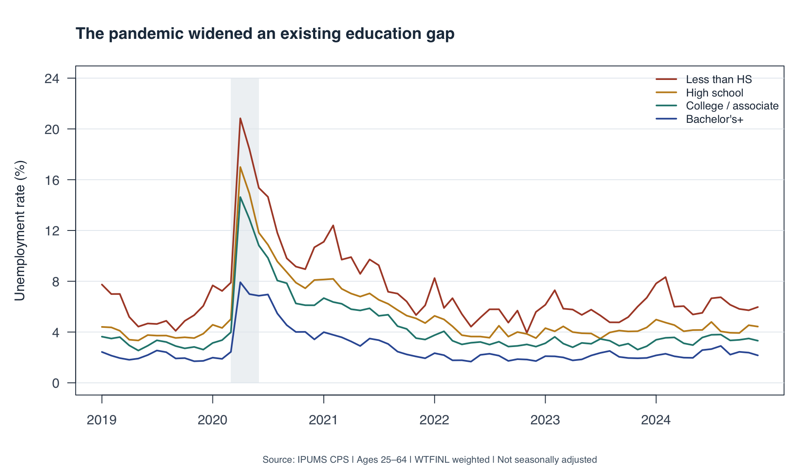
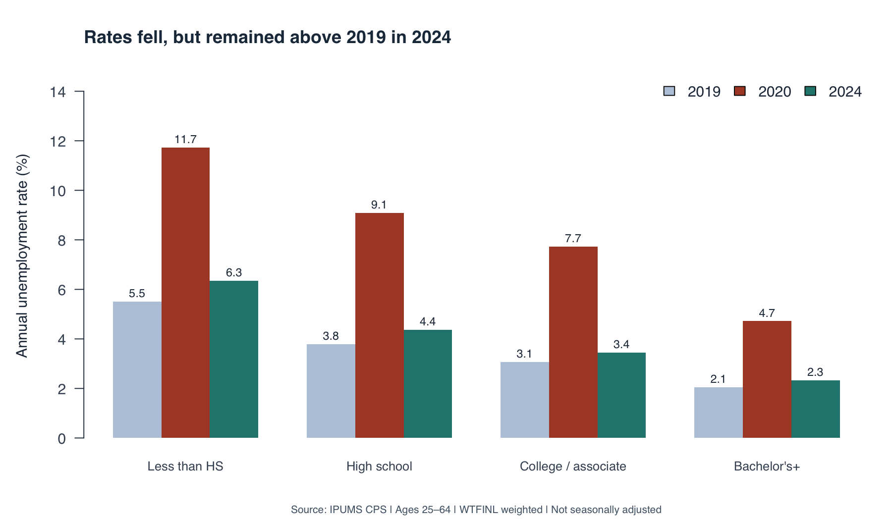
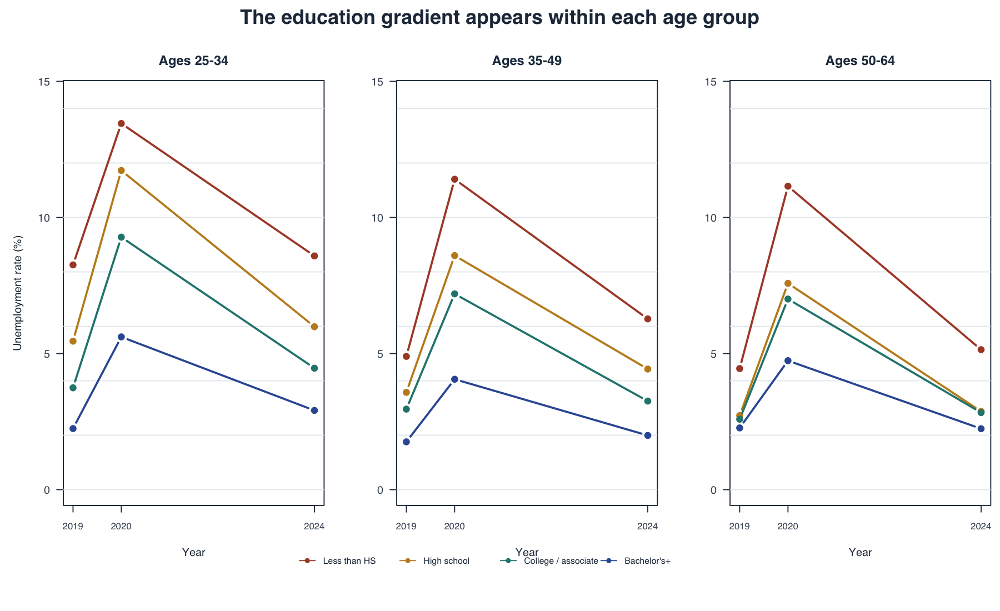

```{r}
#| include: false
s <- readRDS("summary.rds")
source("plots.R")
draw_figures(s)
rate <- function(year, group) s$annual$unemployment_rate[s$annual$YEAR == year & s$annual$education == group]
fmt <- function(x) sprintf("%.1f", x)
```

Did the pandemic erase the unemployment advantage associated with more education?
For someone deciding how to prepare for the labor market, this question matters
because a degree may be associated with stability as well as earnings. I use
IPUMS Current Population Survey (CPS) microdata to compare four education groups
before the pandemic, during its disruption, and through 2024. The story is not
that college graduates escaped unemployment, but that the size of the shock
and the level of risk differed substantially.

## Measuring unemployment consistently

The extract contains all 72 Basic Monthly samples from January 2019 to December
2024, restricted to ages 25–64. This focuses on working-age adults beyond the
usual college years. I group education into less than high school, high school,
some college or an associate degree, and a bachelor's degree or higher. These
groups describe completed education, not current enrollment.

Every estimate uses [WTFINL](https://cps.ipums.org/cps-action/variables/WTFINL),
the monthly person weight. The unemployment rate is weighted unemployed people
divided by the weighted civilian labor force, not all adults:

$$
u_g = 100\frac{\sum_{i\in g} w_i\,1(\text{unemployed}_i)}
{\sum_{i\in g} w_i\,1(\text{employed or unemployed}_i)}.
$$

People outside the labor force do not enter this denominator. Annual rates divide
the sum of monthly weighted unemployment totals by the sum of monthly weighted
labor-force totals. They are ratios of annual-average levels, not simple averages
of monthly percentages. All figures are **not seasonally adjusted**.

## 1. The shock amplified an existing gap

{fig-alt="Four monthly lines from 2019 to 2024 show a sharp 2020 increase in unemployment, largest for adults without a high school diploma and smallest for college graduates."}

The monthly view reveals the abrupt disruption that annual averages can hide.
All four groups experienced a sharp increase in spring 2020, followed by a
decline. The spike was much larger for adults without a high school diploma
than for college graduates. Education differences were visible before the
pandemic and persisted afterward. The lines therefore suggest unequal exposure
to a shared shock, rather than two entirely separate labor markets.

## 2. Recovery did not quite restore the baseline

{fig-alt="Grouped bars compare four education groups in 2019, 2020, and 2024. All groups rise in 2020 and fall by 2024, while remaining above their 2019 rates."}

Among adults without a high school diploma, unemployment rose from
**`r fmt(rate(2019,1))`%** in 2019 to **`r fmt(rate(2020,1))`%** in 2020.
For adults with a bachelor's degree or higher, it rose from
**`r fmt(rate(2019,4))`%** to **`r fmt(rate(2020,4))`%**. The difference between
these groups widened from `r fmt(rate(2019,1)-rate(2019,4))` to
`r fmt(rate(2020,1)-rate(2020,4))` percentage points.

By 2024, their rates had fallen to `r fmt(rate(2024,1))`% and
`r fmt(rate(2024,4))`%, respectively. Each group's 2024 estimate remained above
its 2019 value. This is a descriptive comparison, not a claim that these small
remaining differences are statistically significant.

## 3. Age composition is not the whole story

{fig-alt="Three panels for ages 25–34, 35–49, and 50–64 show the education gradient within each age group across 2019, 2020, and 2024."}

Education groups may contain different mixes of younger and older workers.
Splitting the sample into ages 25–34, 35–49, and 50–64 checks whether that mix
alone explains the pattern. The broad education gradient appears within each
age band, including during the pandemic. However, these are still broad groups:
occupation, industry, experience, and other characteristics may differ within
them. This is not an age-adjusted causal estimate of a degree's value.

## Takeaway and limitations

Higher education was associated with lower unemployment throughout this period,
but it did not eliminate vulnerability. For workforce planning, the figures
support examining job-search assistance and retraining needs among adults with
less education; they do not establish which intervention works best.

CPS respondents can appear in multiple months, so the
`r format(s$audit['retained'], big.mark=',', scientific=FALSE, trim=TRUE)` retained
records are person-month observations, not unique people. The charts present
weighted point estimates without confidence intervals. Pandemic-era
[collection disruptions and lower response rates](https://cps.ipums.org/cps/covid19.shtml)
also warrant caution. Finally, unemployment alone cannot reveal whether people
left the labor force, accepted fewer hours, or experienced wage losses.

## Data and reproducibility

Source: [IPUMS CPS, University of Minnesota](https://cps.ipums.org/cps/citation.shtml),
using underlying U.S. Census Bureau and Bureau of Labor Statistics data.
Extract created September 27, 2026. Education definitions follow
[IPUMS EDUC documentation](https://cps.ipums.org/cps-action/variables/EDUC).

Download the [code and grouped summaries](code-and-summaries.zip),
[analysis script](analyze.R), [plotting script](plots.R), and
[reproduction instructions](REPRODUCE.txt).
The [GitHub repository](https://github.com/qianzhaoli949-afk/qianzhao-website)
contains this post under `blog/posts/post3/`. Licensed microdata are not redistributed;
registered users can recreate the extract using the documented selections.

```{r}
#| eval: false
# From the post3 folder, after running analyze.R with your local extract paths:
s <- readRDS("summary.rds")
source("plots.R")
draw_figures(s)
```
