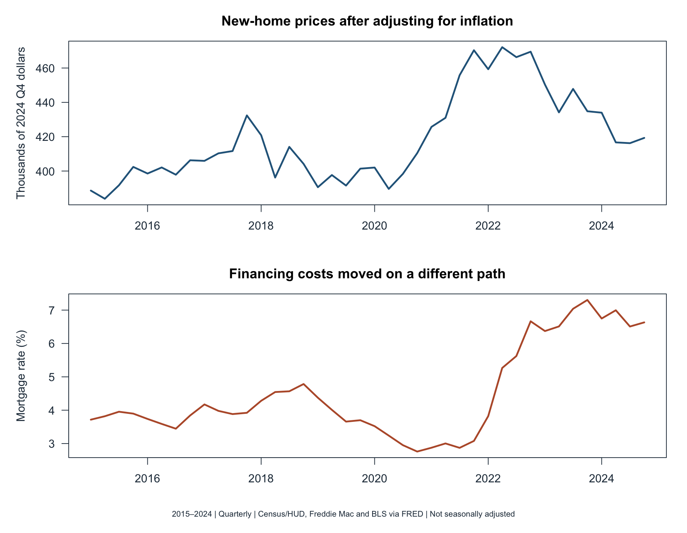
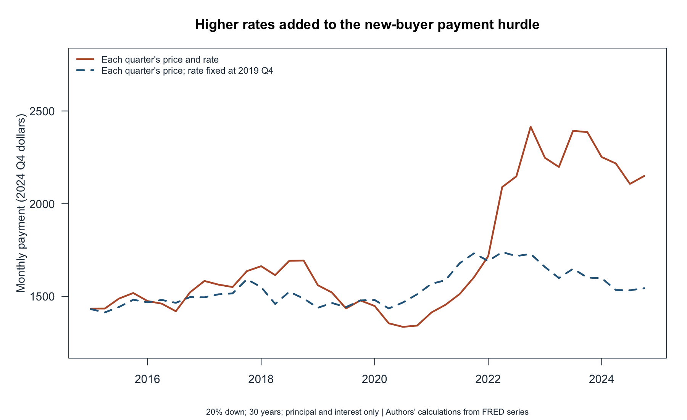
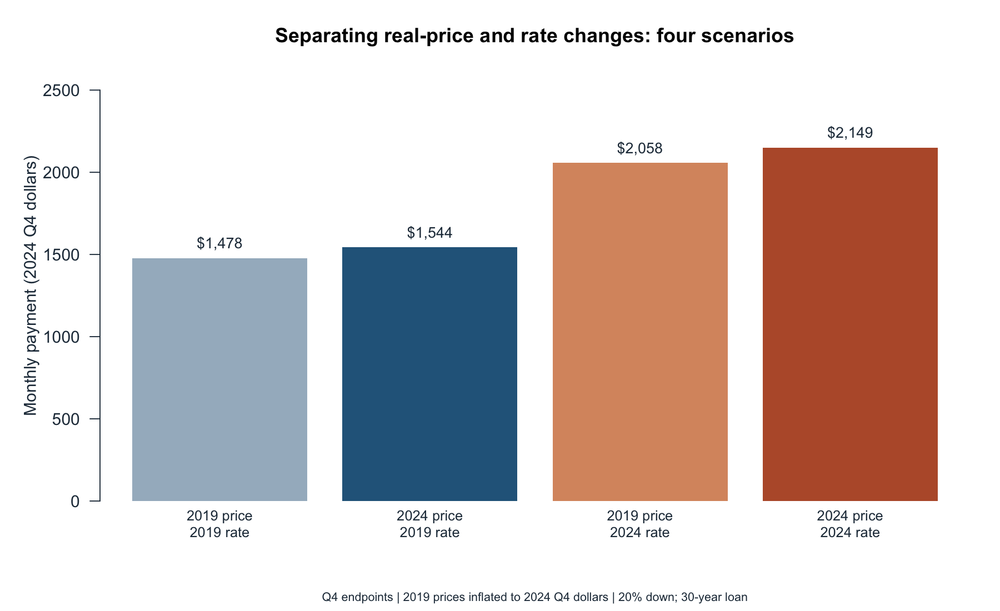

```{r}
#| include: false
source("code/analyze.R")
old <- d[d$quarter == "2019Q4", ]
end <- d[d$quarter == "2024Q4", ]
usd <- function(x) paste0("$", format(round(x), big.mark=",", trim=TRUE))
pct <- function(x) sprintf("%.1f", x)
```

A lower advertised house price does not necessarily mean a lower monthly
payment. Buyers finance both a property and the cost of borrowing. **How did
changes in real new-home prices and mortgage rates combine to change an
illustrative buyer's payment between 2019 and 2024?** I place those endpoints
within a decade of quarterly data, separating purchasing-power changes from
financing costs. This is a payment comparison, not a complete measure of
housing affordability relative to income.

## From three series to a comparable payment

I download three series programmatically from FRED: Census/HUD's
[median new-home sales price (MSPUS)](https://fred.stlouisfed.org/series/MSPUS),
Freddie Mac's [30-year mortgage rate (MORTGAGE30US)](https://fred.stlouisfed.org/series/MORTGAGE30US),
and BLS's [all-items CPI (CPIAUCNS)](https://fred.stlouisfed.org/series/CPIAUCNS).
These are new data for this blog, distinct from the earlier O*NET and CPS projects.

The price series is quarterly. I average weekly mortgage observations and the
three monthly CPI observations within each quarter, producing 40 quarters
from 2015 through 2024. I stop at 2024 because the downloaded CPI series has
no October 2025 observation; I do not impute it or average an incomplete quarter.
All three series are not seasonally adjusted. Endpoint comparisons use Q4
in both years, although that does not remove all seasonal influences.

For a hypothetical purchase each quarter, I assume a 20% down payment and a
fully amortizing 30-year fixed-rate mortgage. Monthly principal and interest are

$$
M=0.8P\frac{r/1200}{1-(1+r/1200)^{-360}},
$$

where $P$ is the sales price and $r$ is the annual interest rate in percent.
Multiplying prices and payments by $CPI_{2024Q4}/CPI_t$ expresses them in
**2024 Q4 dollars**. These transformations make monetary comparisons meaningful
without confusing general inflation with housing-specific changes.

## 1. The price and the financing cost are different moving parts

{fig-alt="Two aligned panels show inflation-adjusted new-home prices and mortgage rates from 2015 to 2024."}

The first figure separates the two inputs rather than putting unlike units on
a dual axis. From 2019 Q4 to 2024 Q4, the real median price changed by
`r pct(100*(end$real_price/old$real_price-1))`%, while the average mortgage
rate moved from `r pct(old$rate)`% to `r pct(end$rate)`%. Price movements
alone therefore cannot describe the change faced by a financed buyer.

## 2. Translate those inputs into monthly dollars

{fig-alt="Two lines compare real mortgage payments using each quarter's rate with payments at a fixed 2019 Q4 rate."}

The modeled real payment rose from **`r usd(old$payment_real)`** to
**`r usd(end$payment_real)`**, a `r pct(100*(end$payment_real/old$payment_real-1))`%
increase. The dashed line keeps each quarter's price but holds the interest
rate fixed at its 2019 Q4 value. By 2024 Q4, that calculation yields
`r usd(end$payment_fixed_rate_real)`, or
`r usd(end$payment_real-end$payment_fixed_rate_real)` less per month than
the contemporaneous-rate scenario. This is a controlled arithmetic comparison,
not a claim that buyers could actually obtain the old rate.

## 3. Change one input at a time

{fig-alt="Four bars show payments at the baseline, with only the price changed, with only the rate changed, and with both changed."}

The third figure holds the other input constant in each middle bar. The
price-only change adds `r usd(scenarios$payment[2]-scenarios$payment[1])`
to the baseline payment; the rate-only change adds
`r usd(scenarios$payment[3]-scenarios$payment[1])`.
These separate increments need not sum to the combined increase: a higher rate
also applies to the changed loan amount. The chart isolates the financing
mechanism, rather than estimating a causal effect of monetary policy on prices.

## Takeaway and limits

Evaluating a home by its sticker price alone misses a major part of the
financing calculation. A practical budgeting exercise should vary both the
price and the offered rate, then add taxes, insurance, maintenance, and fees,
which are excluded here. The down payment itself is another constraint.

These are illustrative payments for new buyers, not average payments of
existing homeowners. New-home medians change with the mix of homes sold and
are not a constant-quality price index. National series mask local differences;
the mortgage benchmark is not an individual loan quote. Freddie Mac also
changed its survey methodology in November 2022. Without household income,
credit, or wealth data, the figures cannot tell us who can afford to buy.

## Reproduce the analysis

The [README](README.md) documents folders, assumptions, and commands.
[Analysis code](code/analyze.R), [plotting code](code/plots.R),
[quarterly data](data/quarterly.csv), and [download provenance](data/manifest.csv)
are available alongside the [GitHub repository](https://github.com/qianzhaoli949-afk/qianzhao-website/tree/main/blog/posts/post4).
Ordinary rendering checks and reuses saved downloads; an explicit refresh
retrieves new data, which may include revisions.
