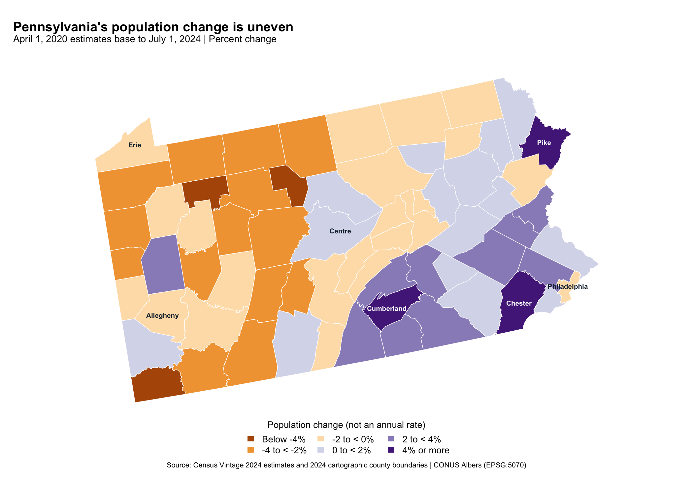
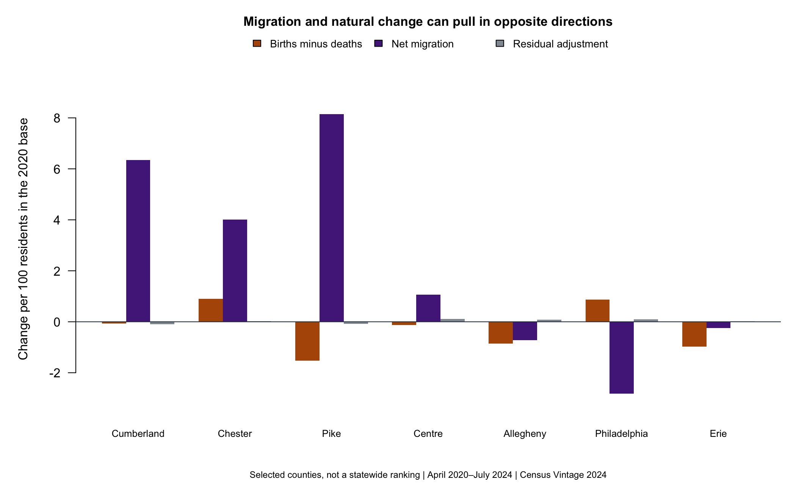

```{r}
#| include: false
source("code/analyze.R")
value <- function(county,field) d[d$county==county,field]
num <- function(x) format(round(x),big.mark=",",trim=TRUE)
pct <- function(x) sprintf("%.1f",x)
state_pct <- 100*sum(d$change)/sum(d$base2020)
```

Living in Philadelphia makes me curious about how the rest of Pennsylvania
is changing. Does population growth spread across the state, or does it
concentrate in a few places? The answer matters for decisions about housing,
transportation, and local services. A growing state can still contain many
communities that lose residents.

I use the Census Bureau's Vintage 2024 county population estimates and its
2024 county boundaries. I keep this fixed release for reproducibility; it is
not the newest Census vintage. My comparison runs from the April 1, 2020
estimates base to July 1, 2024. That starting point is the Census Bureau's
population-estimates base, not simply a count from the decennial census.

## A small statewide gain hides a divided map

Pennsylvania gained `r num(sum(d$change))` residents, or about
`r pct(state_pct)`%, over this period. Yet `r sum(d$change<0)` of its 67 counties
lost population. Those statements do not conflict: counties have different
population sizes, so counting counties does not measure the statewide change.

{fig-alt="Pennsylvania county map shows growth in much of the southeast and south-central area, and declines across much of the west and north. Philadelphia and Allegheny decline, while Chester, Cumberland, and Pike grow."}

The map shows a broad contrast. Many southeastern and south-central counties
gained residents, while many western and northern counties lost them. Chester
grew by `r pct(value("Chester","change_pct"))`%, and Cumberland grew by
`r pct(value("Cumberland","change_pct"))`%. Pike, in the northeast, grew by
`r pct(value("Pike","change_pct"))`%, so the pattern is not a simple east–west split.

Philadelphia lost `r pct(abs(value("Philadelphia","change_pct")))`% of its
population, even as several nearby counties grew. Allegheny also declined,
while nearby Butler grew. These contrasts suggest that local planners should
look beyond a single city or statewide average. They do not prove that people
moved directly from those cities to the growing counties; the data here do
not track individual moves between specific places.

I map percentage changes rather than raw counts to compare counties of
different sizes. But counts still matter for planning. Pike's faster growth
amounted to `r num(value("Pike","change"))` additional residents, compared with
`r num(value("Chester","change"))` in Chester. A high growth rate in a small
county can mean fewer additional residents than slower growth in a larger one.

## What sits behind the change?

Population changes through births, deaths, and migration. The second figure
compares seven reference counties from the map. It shows each contribution
per 100 residents in the 2020 base, so the values add up to the county's
percentage change. These are cumulative contributions, not annual rates.

{fig-alt="Migration contributes strongly to growth in Cumberland, Chester, and Pike. Philadelphia has more births than deaths but a larger negative migration contribution. Allegheny and Erie have negative natural change and net migration."}

Pike and Cumberland gained enough residents through migration to outweigh
their excess of deaths over births. Philadelphia shows the opposite balance:
births exceeded deaths by `r num(value("Philadelphia","natural_change"))`,
but net migration reduced its population by
`r num(abs(value("Philadelphia","net_migration")))`. Allegheny and Erie
experienced both more deaths than births and negative net migration.
The same outcome—population decline—can therefore involve different balances
between these components.

## What the pattern means for planning

Growing counties may need to examine housing capacity and service demand.
Counties losing residents still need to maintain roads and provide services,
possibly across a smaller population base. The map helps identify places for
closer study; it does not tell officials how much to build or spend. They
would also need information about age, housing vacancies, and local budgets.

Several limits matter. County averages hide changes within neighborhoods.
Large rural counties occupy more map space without necessarily containing
more people. The estimates can change in later releases, and the map's color
boundaries do not mark statistically significant differences. Finally, these
data describe population accounting, not why people chose to move. I cannot
separate the effects of jobs, housing costs, or remote work from this map alone.

My takeaway is that Pennsylvania's modest overall growth hides different
local needs. The map locates those differences, and the components show why
one statewide story is not enough.

## Sources and reproduction

I download the [population estimates](https://www2.census.gov/programs-surveys/popest/datasets/2020-2024/counties/totals/co-est2024-alldata.csv)
and [county boundaries](https://www2.census.gov/geo/tiger/GENZ2024/shp/cb_2024_us_county_500k.zip)
directly from the Census Bureau. Its [field definitions](https://www2.census.gov/programs-surveys/popest/technical-documentation/file-layouts/2020-2024/CO-EST2024-ALLDATA.pdf)
explain the population components.

My R code joins the files by five-digit county FIPS codes, checks all 67
matches, and maps them with `sf` in a U.S. Albers equal-area projection.
See the [README](README.md), [analysis code](code/analyze.R),
[plotting code](code/plots.R), [county results](data/pa-counties.csv),
or [complete reproduction download](reproduction.zip).
The [GitHub repository](https://github.com/qianzhaoli949-afk/qianzhao-website/tree/main/blog/posts/post5)
contains the same source files.
